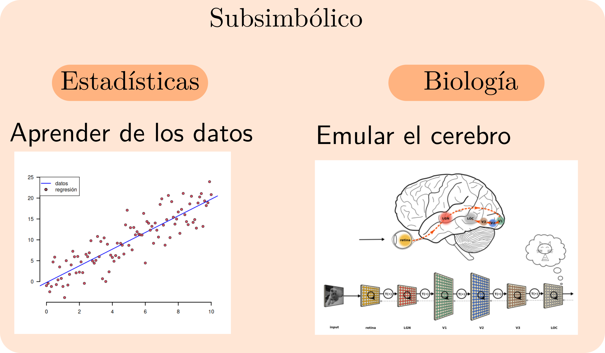
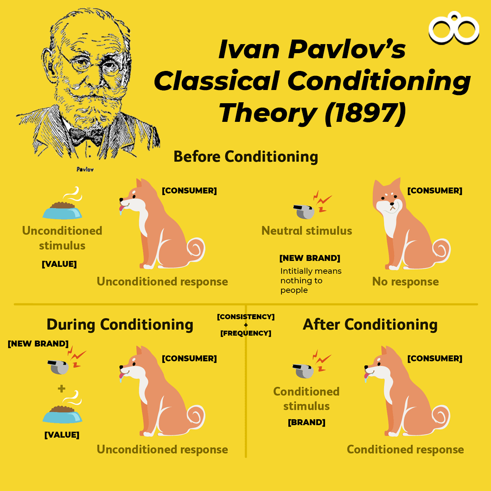
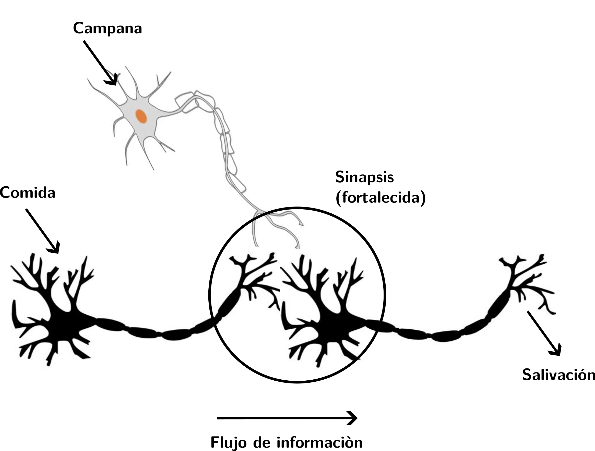
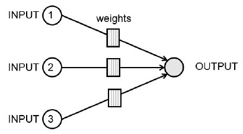
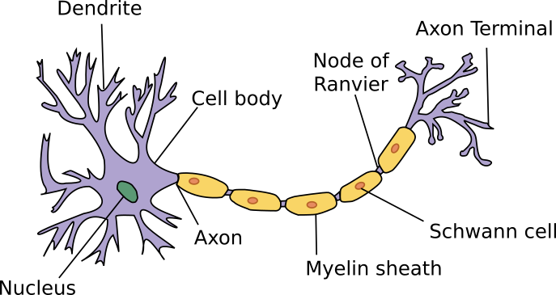
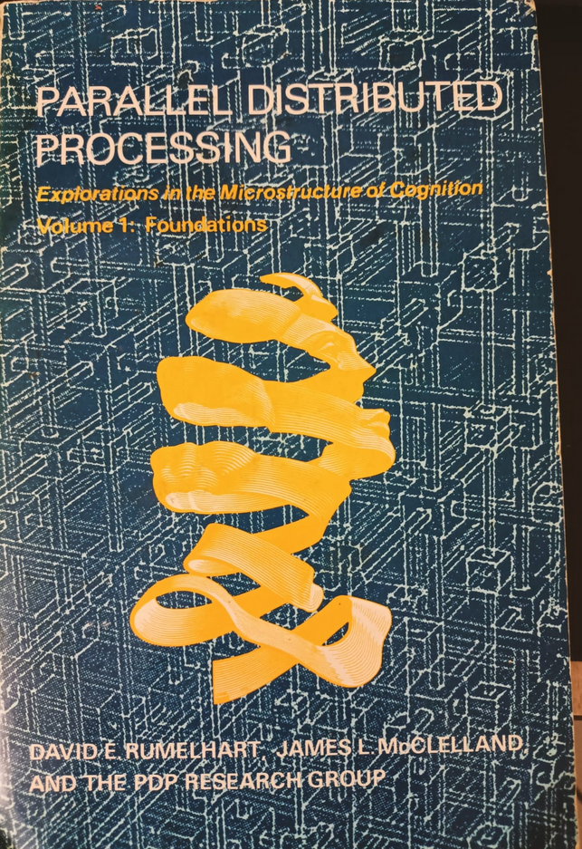
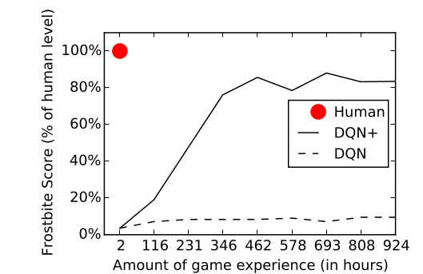

class: title-slide middle center

# `r rmarkdown::metadata$title`

## `r rmarkdown::metadata$subtitle`

.author[
`r rmarkdown::metadata$author`
]


```{r setup, include=FALSE}
options(htmltools.dir.version = FALSE)
library(knitr)
opts_chunk$set(echo = FALSE, dpi = 300)
```


```{r xaringan-themer, include=FALSE, warning=FALSE}
library(xaringanthemer)
style_duo(
  base_font_size = "23px",
  primary_color = "white",
  background_color = "white",
  inverse_header_color = "#BB945D",
  secondary_color = "#12695E",
  title_slide_text_color = "#970639",
  text_color = "#12695E",
  text_font_family = "Latin Modern Sans",
  header_h1_font_size = "2.2rem",
  text_font_size = "1.2rem",
  header_font_family = "Latin Modern Sans",
  code_font_family = "FiraCode Nerd Font"
)
```

---
class: middle inverse

.strong[
  ¿Qué pensamos cuando escuchamos el término "Inteligencia Artificial"?
]

--

- Probablemente solo en su rama aplicada: 

.pull-left[
```{r self_driving, out.width='80%', fig.cap='Self-driving'}

```

]

--

.pull-right[

```{r art, out.width='100%', fig.cap='DALL-E'}

```
]

---

class: middle inverse

- La IA tiene también una vertiente más científica, o de investigación, cuyo propósito principal es modelar y en ese sentido entender la cognición humana.

--

- Aunque no es tan conocido, esa vertiente ha sido influida por la psicología, especialmente la que investiga la percepción y el aprendizaje.

--

- Desde esta perspectiva, la psicología aún puede influir en la IA y de hecho transformarla.

---
class: middle

## ¿Qué es la IA?

- Una definición muy general de la IA es como el estudio de agentes que perciben su entorno y ejecutan acciones para alcanzar un objetivo.

--

- Uno de sus objetivos es la creación de máquinas o algoritmos cuyo comportamiento (y solo su comportamiento) sea indistinguible del de organismos inteligentes.

--

- Es decir, desde sus inicios, la IA se planteó crear agentes artificiales tan inteligentes o más que agentes naturales.

--

- Es natural plantearse la idea de que, para ese objetivo, se debería investigar primero a los agentes cuya inteligencia se quiere emular.

---

## Dos métodos de la IA:
--

.pull-left[
```{r anarchy,out.width='110%', fig.cap='Anarquía de métodos'}

```
]

--

.pull-right[
- Simbólica: Fue el paradigma dominante en la IA de mediados de los 50s hasta los 80s (no ha desaparecido).

- Subsimbólica: basada en aprendizaje. A su vez, una rama basada en estadística y otra (conexionista), en redes neurales.

]

---
## La importancia del aprendizaje

- El aprendizaje resuelve un problema importante. Si naciéramos con habilidades fijas e inmutables, no podríamos hacer frente a un mundo cambiante.

--

- Nos permite adaptarnos a situaciones muchas veces impredecibles:

--
  -	 En el tiempo (cuándo va a ocurrir)
--

  -  En el lugar (en dónde va a ocurrir)
--

  -  En relacion a otros eventos (¿qué tan probable es que llueva si está nublado?)

---

## ¿Cómo lo hacemos?

--

- La psicología y las neurociencias han estudiado y descubierto un conjunto de principios (mínimos) que todos los animales (e incluso bacterias) deben tener para poder adaptarse a situaciones cambiantes e inesperadas.

--

  - Sensores especializados, es decir, una forma de 'sentir' su entorno y diferenciar entre distintos tipos de señales (por ejemplo, calor de frío, luz de oscuridad, etc).

--

  - Una forma de responder diferente a diferentes eventos. Las formas más básicas son acercarse o alejarse (e.g., un pollito que se aproxima al calor pero se aleja del ruido). 

---

## Ejemplo: aprendizaje asociativo

```{r pavlov_conditioning, out.width='50%', fig.cap='', fig.align='center'}

```

---

- Investigaciones como las de Pavlov llevaro a muchos a preguntarse lo siguiente:

 .inverse[¿qué ocurre biológicamente cuando un animal experimenta algo, y la siguiente vez que lo experimenta responde diferente?].

--

- Algo tenía que *preservar* esa experiencia.

--

- En 1949, Donald Hebb, un psicólogo canadiense, respondió a esa pregunta:

--

>«Cualquier par de células o sistemas de células que estén repetidamente activos al mismo tiempo tenderán a "asociarse" de modo que la actividad en una facilite la actividad en la otra.»

--

A esta forma de aprendizaje en IA se llamaría después "aprendizaje no supervisado", en donde no se predice nada ni se evalúa si se está bien o no.

---

```{r hebb_learning, out.width='60%', fig.cap='Hebbian theory', fig.align="center"}

```

---

## Modelando el cerebro: conexionismo

--

El *insight* de Hebb de que existen correlatos biológicos del aprendizaje y memoria fue revolucionario: permitió resumir resultados empíricos en un *principio*; este principio fue formalizado (matemáticamente).

--

Paralelamenente, la investigación en aprendizaje animal seguía progresando principalmente en dos áreas: condicionamiento pavloviano y condicionamiento instrumental.

--

Gran parte de esa investigación se resumía en la idea de que los animales podían aprender estructura ricas de información de su entorno, y *anticiparse* a eventos futuros.

---
class: middle

.pull-left[
```{r Cielo, fig.align = "center", out.width='100%'}

```
]

--

.pull-right[
```{r paraguas, fig.align = "center", out.width='50%'}

```
]

---
class: inverse middle


Es decir, podían hacer predicciones.

--

Pero si podían hacer predicciones, podían equivocarse: habría un *error de predicción*:

$$
error = \text{predicción} - \text{observación}
$$

--

La siguiente vez que nuestro agente se encontrara con esta situación, tomaría en cuenta su error y realizaría ajustes.

--

```{r rw, fig.align = "center", out.width='50%', fig.width=5, fig.height=3}

update_V <- function(value_i, # Initial or value until trial i-th
                     alpha, # learning parameters
                     beta,
                     lambda) {
  value_sum <- sum(value_i) # value at i-th trial
  prediction_error <- lambda - value_sum # prediction error
  value_delta <- alpha * beta * prediction_error # change in V strength
  value_i <- value_i + value_delta # update value
  value_i # return value
}

lambda <- rep(1, 50)
trials <- length(lambda)
# learning parameters
alpha <- 0.3
beta <- 0.3
# Define a vector to store results
V_t <- numeric(trials)

for (t in 2:trials) {
  V_t[t] <- update_V(
    value_i = V_t[t - 1],
    alpha = alpha,
    beta = beta,
    lambda = lambda[t - 1]
  )
}

# Plot results
par(
  mgp = c(1.5, 0.3, 0),
  mar = c(3, 3, 2.5, 1) + 0.1,
  family = "sans",
  las = 1
)

plot(V_t,
  xlab = "Trial Number",
  ylab = "Learning",
  axes = F,
  main = "Learning curve",
  type = "l",
  lwd = 2,
  col = "red"
)
axis(1, lwd = 1, lwd.tick = 0.8, tck = -0.012, cex.axis = 0.8)
axis(2, lwd = 1, lwd.tick = 0.8, tck = -0.012, cex.axis = 0.8)

box()
```

---

## **Frank Rosenblatt** y el perceptrón

Inspirándose en la fisiología de una neurona, Rosenblatt diseñó una estructura, a la que llamó *perceptrón*, que podía clasificar objetos aprendiendo por *reforzamiento* de muestras ya clasificadas.

--

También evaluó qué tan bien aprendía mediante un error de predicción, usando dos conjuntos de datos: *training* y *testing*. 

--

Esta forma de aprendizaje se llamaría posteriormente como "aprendizaje supervisado". 

---
class: middle

.pull-left[
```{r perceptron, fig.cap = "Perceptron model", fig.align = "center", out.width="100%"}

```
]

.pull-right[
```{r neurona, fig.cap = "Neuron", fig.align = "center", out.width='100%'}

```
]

---

## Decadencia del conexionismo y resurgimiento

--

.pull-left[
- A finales de los 60s el interés por la IA subsimbólica descendió.

- No fue hasta los 80s que volvió a resurgir por un grupo de psicólogos (!) de la universidad de California: PDP Group (*Parallel Distributed Processing*).

- Fue el antecesor directo del DeepLearning.
]

--

.pull-right[
```{r pdp, fig.cap = "DL foundational books", fig.align = "center", out.width='55%'}

```
]

---
class: middle

.strong[NETtalk, 1986]

<center>
  <video width="70%" controls id="my_video">
  <source src="./images/NETtalk Test [gakJlr3GecE].mp4" type="video/mp4">
  </video>
</center>

---

## Quo vadis?

- La filosofía subyacente al DeepLearning es un empiricismo fuerte: que podemos aprender casi cualquier cosa a partir de patrones estadísticos.

--

- Su abrumador éxito (que experimentamos todos los días) esconde algunas dificultades.

--

- Una es que exceden la habilidad humana en tareas específicas, pero fallan en generalizar sus habilidades fuera de los estrechos dominios en los que las aprendieron.

--

- Otra es que los humanos necesitamos *pocas muestras* para dominar una tarea (e.g., en niños aprendiendo a hablar).

---
class: middle

```{r dl_vs_human, fig.cap = "Human performance on Frosbite against two DL algorithms. From: Lake et al, Building machines that learn and think like poeple", fig.align = "center", out.width='60%'}

```

---

Diversos psicólogos, a caballo entre las ciencias cognitivas y la IA. coinciden en lo siguiente:

--

- La IA debe ser capaz de diseñar agentes que construyan modelos causales de su entorno que puedan ser explicados, en vez de solo resolver problemas de reconocimiento de patrones.

--

- Cimentar el aprendizaje en teorías intuitivas de la física y la psicología (i.e., dotarlos de "sentido común" para predecir eventos sobre colisiones, velocidades, permanencia de formas y número, estabilidad, etc).

--

- Explotar la habilidad de aprender a aprender para adquirir y rápidamente generalizar el conocimiento a nuevas tareas y situaciones, *fuera de las situaciones en las que aprendieron*.

---
class: middle inverse

## Problemas éticos

--

- La IA tiene el potencial de transformar radicalmente nuestras concepciones de qué significa ser humano.

--

- Esto abre algunas cuestiones. Ahora no solo nos preguntamos si *es posible* crear inteligencia artificial general, sino *si deberíamos* hacerlo.

---
class: middle

En mayo del 2014, Douglas Hofstadter y Melanie Mitchell, dos investigadores pioneros en cognición, computación, IA y sistemas complejos, visitaron las oficinas centrales de Google.

--

Melanie (en Artificial Intelligence. A guide for thinking humans) relata

--

«Las preocupaciones de Hofstadter fueron enfatizadas por el apoyo de Google [a la visión] de que la IA, facultada por su habilidad de automejora, alcanzará pronto, y luego a superar, inteligencia al nivel humano. Google, eso parecía, estaba haciendo todo para acelerarlo. "Estaba aterrorizado por los escenarios [dijo Hofstadter]. Estaríamos completamente fuera de guardia. Pensaremos que nada está pasando y, de repente, las computadoras serán más inteligentes que nosotros". Siguió "Me parece muy aterrador, muy preocupante, muy triste; y me parece terrible, horrible, extraño, desconcertante, que las personas se apresuren ciega y delirantemente a crear estas cosas."»

---
class: middle

La preocupación de Hofstadter no era sobre la maldad o la pérdida de privacidad, cosas que por supuesto pueden ser preocupantes. 

--

Su preocupación era más trascendental: lo que más valoraba en la humanidad, como el Ulises de Joyce, la séptima de Beethoveen, el Oratorio de Navidad de Bach o Las Meninas de Velázquez, pináculos del «espíritu humano», pudiera ser reproducido y explicado por un algoritmo de fuerza bruta. 

--

>«Si tales mentes de infinita sutilidad y complejidad y profundidad emocional pudieran ser trivializadas por un chip pequeño, destruiría mi sentido de lo que significa ser humano»

